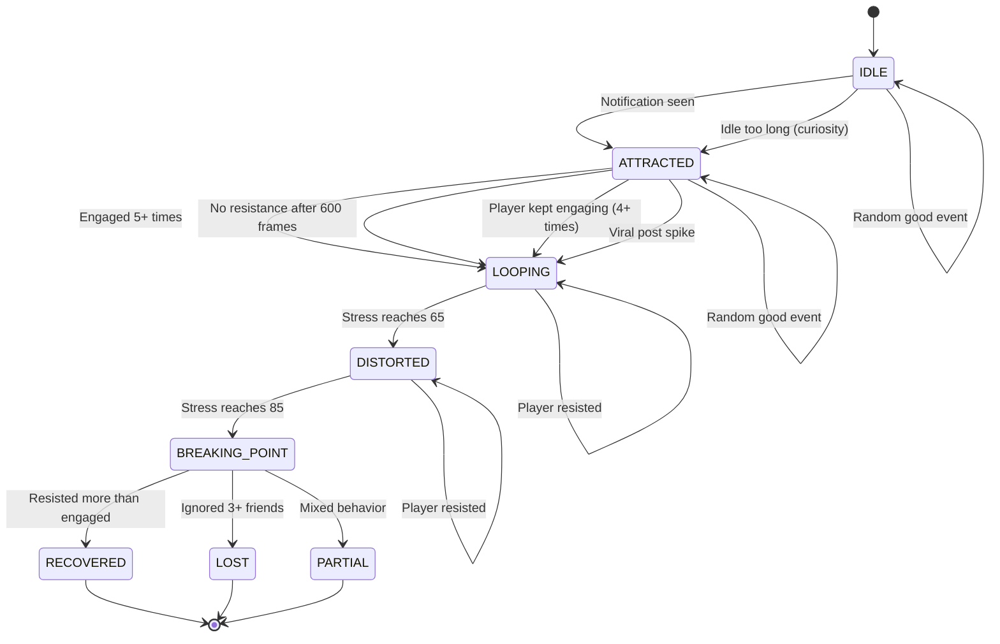
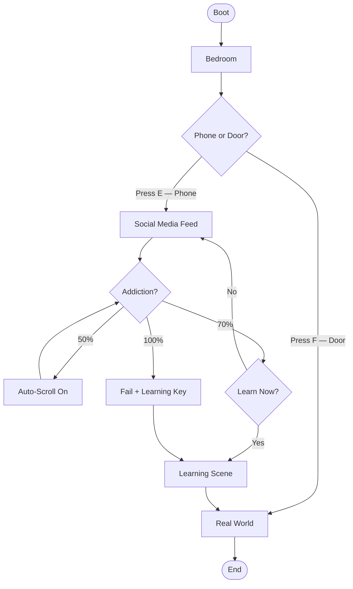
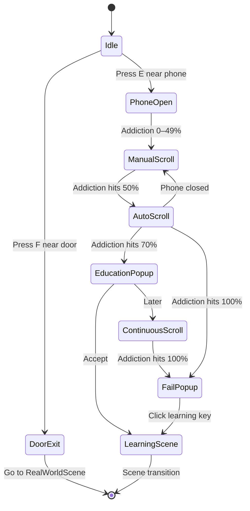
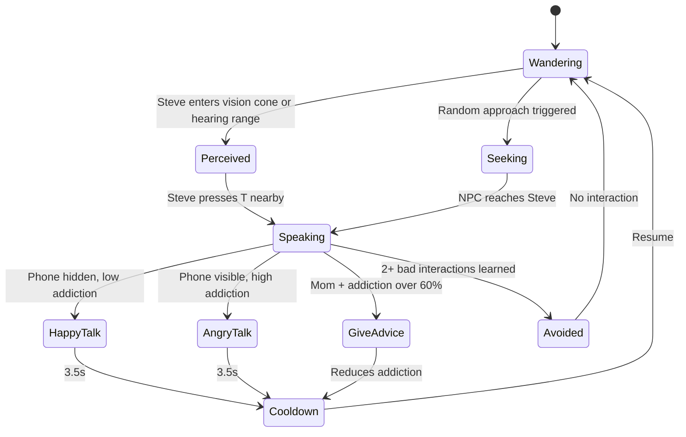
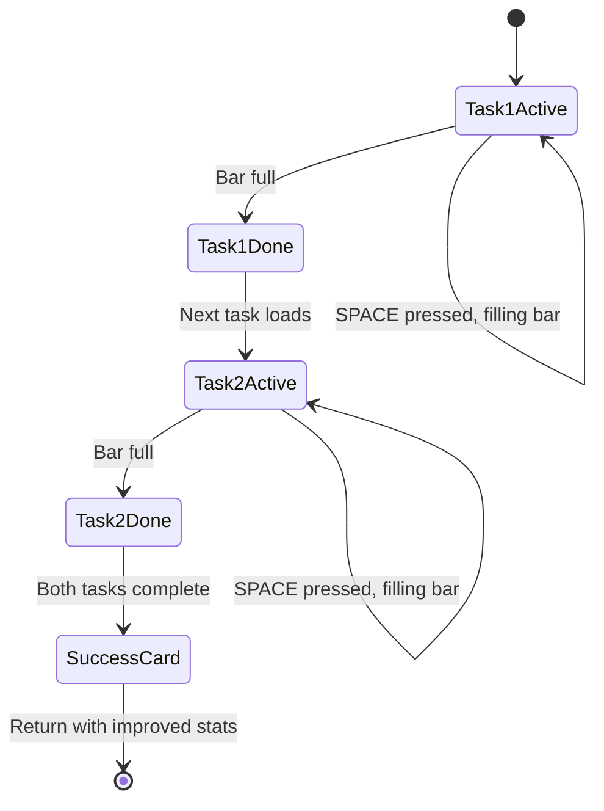
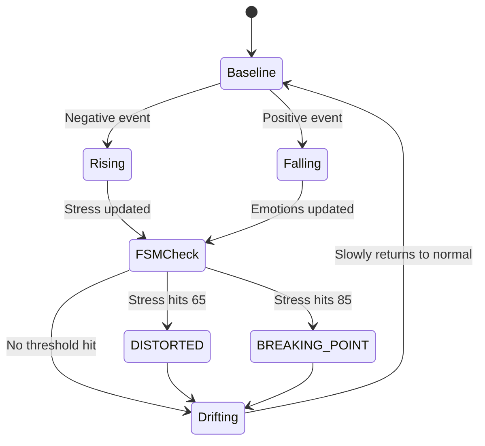
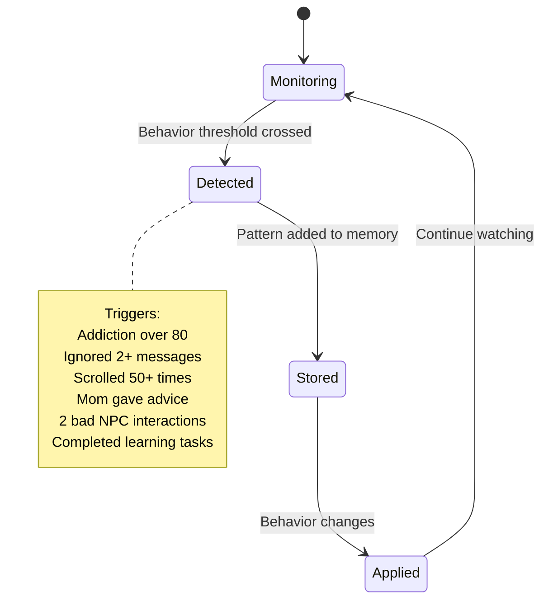
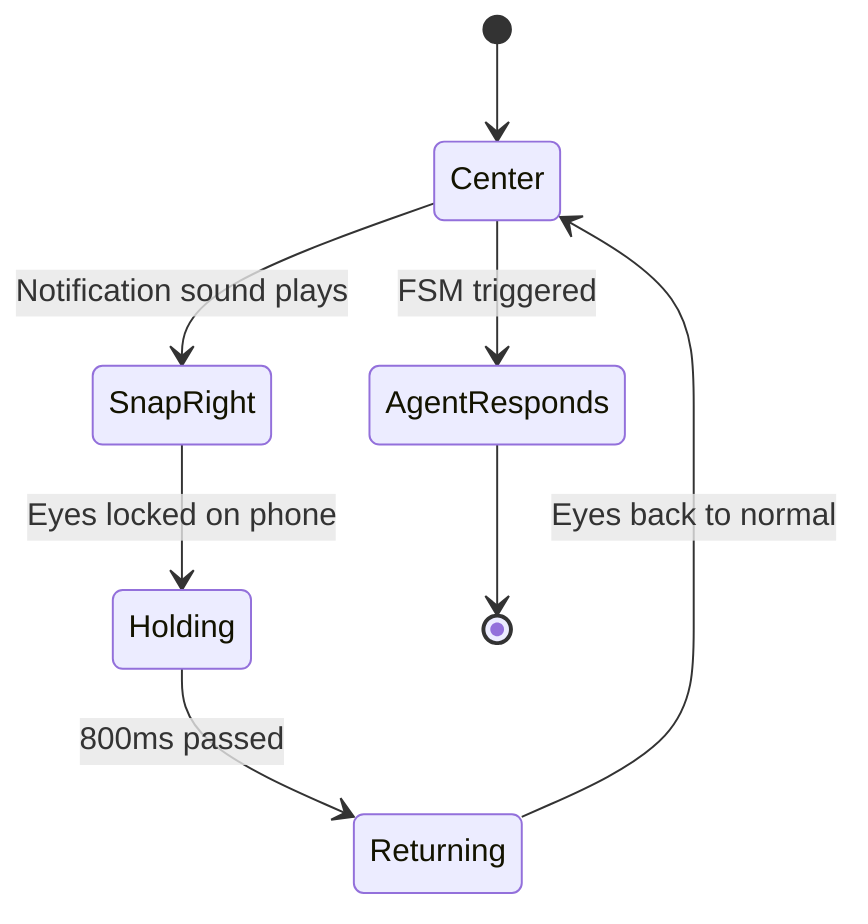

# 4. State Diagrams

## 4.1 Agent FSM — Full State Transitions

---

## 4.2 Scene Flow

---

## 4.3 AttractionScene — Phone States

---

## 4.4 NPC Behavior — States

---

## 4.5 LearningScene — Task States

---

## 4.6 Emotion System — States

---

## 4.7 Memory & Learning — States

---

## 4.8 Eye Movement — States

---

## Reference Tables

### FSM States
| State | Meaning | Visual |
|-------|---------|--------|
| IDLE | Calm, not engaged | Upright, neutral |
| ATTRACTED | Phone caught attention | Slight smile |
| LOOPING | Habit forming | Slight hunch |
| DISTORTED | Stressed, losing grip | More hunched |
| BREAKING_POINT | Critical moment | Fully hunched, frown |
| RECOVERED | Chose real world | Upright, green shirt |
| PARTIAL | Mixed outcome | Neutral |
| LOST | Fully addicted | Hunched, grey |

### Addiction Thresholds
| Level | Effect |
|-------|--------|
| 50% | Auto-scroll activates |
| 70% | Educational popup shown |
| 100% | Failure — learning key appears |

### Scene Transitions
| From | To | Trigger |
|------|----|---------|
| Boot | Bedroom | Click screen |
| Bedroom | Real World | Press F at door |
| Bedroom | Learning | Accept popup or learning key |
| Learning | Bedroom | Complete both tasks |
| Real World | End | Finish conversation |
