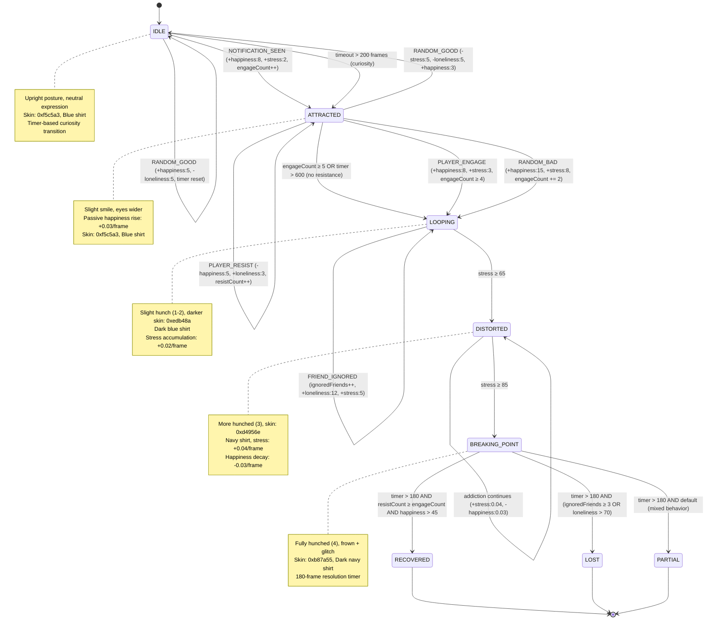
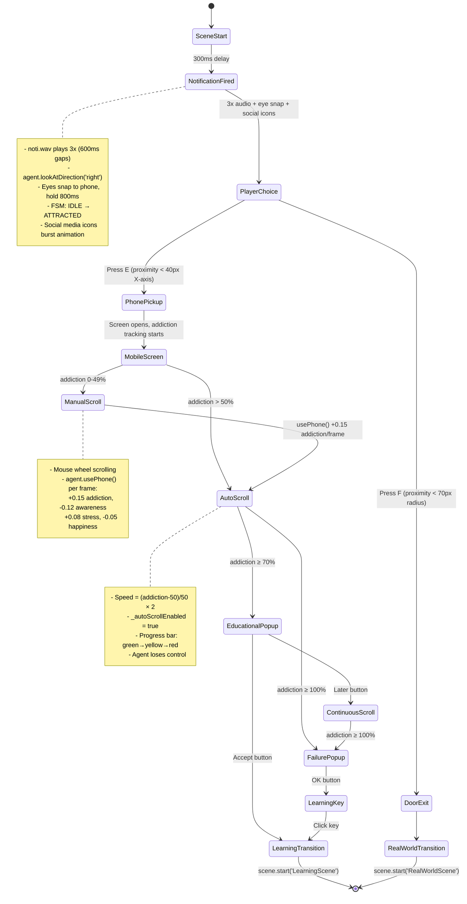
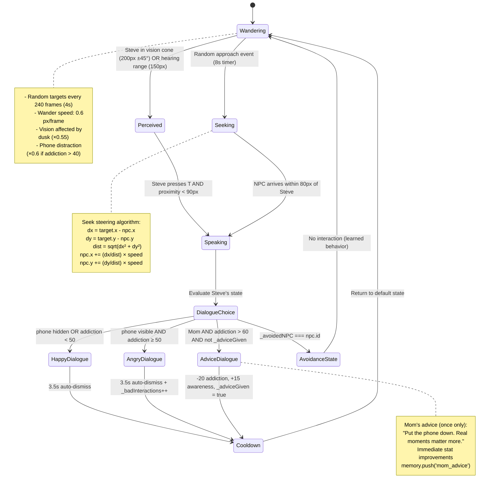
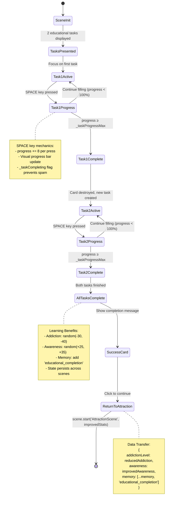
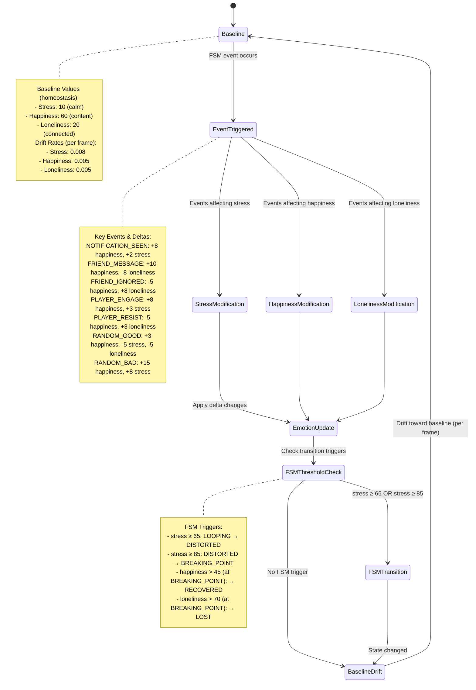
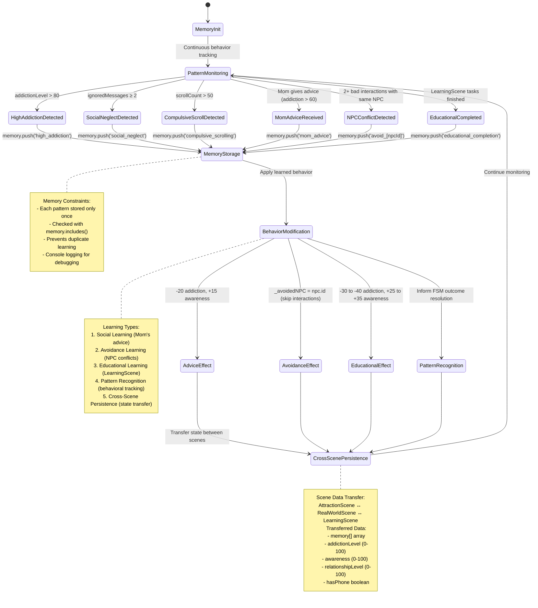
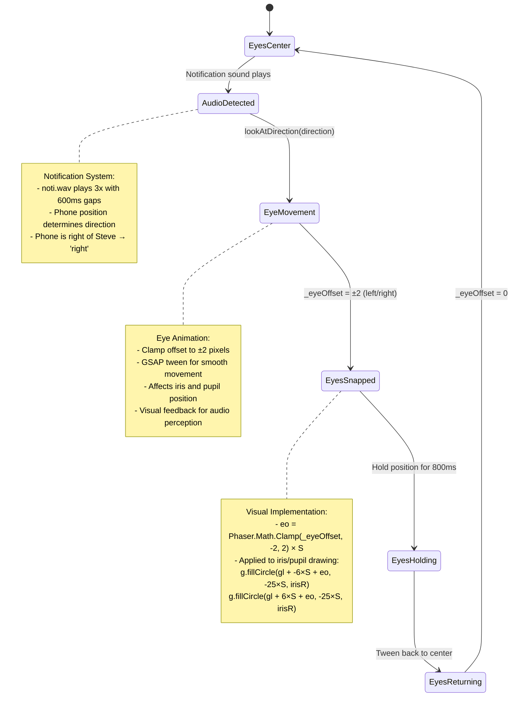

# 4. State Diagrams — UML Diagrams

## 4.1 Agent FSM State Transition Diagram (Mermaid)



## 4.2 Overall Scene Flow Diagram (Mermaid)

```mermaid
flowchart TD
    A[BootScene<br/>Title Screen] --> B[AttractionScene<br/>Steve's Bedroom]
    
    B --> C{Player Choice}
    C -->|Walk to Door<br/>Press F near door| D[RealWorldScene<br/>Outdoor Park]
    C -->|Pick up Phone<br/>Press E near phone| E[Mobile Screen<br/>Social Media Feed]
    
    E --> F{Addiction Progression}
    F -->|Manual Scroll<br/>0-49% addiction| G[User Controls Scrolling]
    F -->|Auto-Scroll<br/>50-69% addiction| H[System Takes Control]
    F -->|70% Addiction| I{Educational Popup}
    F -->|100% Addiction| J[Failure Notification]
    
    G --> H : addiction increases
    H --> I : addiction reaches 70%
    H --> J : addiction reaches 100%
    
    I -->|Accept Learning| K[LearningScene<br/>Study Room]
    I -->|Later| L[Continuous Scroll Mode]
    
    L --> J : addiction reaches 100%
    
    J --> M[Learning Key Appears]
    M -->|Click Key| K
    
    K --> N{Task 1 Complete?}
    N -->|SPACE key progress| O{Task 2 Complete?}
    N -->|No| N
    O -->|SPACE key progress| P[Success Card]
    O -->|No| O
    
    P -->|Click| Q[Return to AttractionScene<br/>Improved Stats]
    Q --> D
    
    D --> R[3-Second Delay]
    R --> S[7-Line Group Conversation<br/>T key advances]
    S --> T[Group Walk to Road<br/>400ms + 1000ms delay]
    T --> U[EndScene<br/>Journey Complete]
    
    style A fill:#e1f5fe
    style B fill:#f3e5f5
    style D fill:#e8f5e8
    style K fill:#fff3e0
    style U fill:#fce4ec
```

## 4.3 AttractionScene Addiction Progression (Mermaid)



## 4.4 RealWorldScene NPC Behavior (Mermaid)



## 4.5 LearningScene Task System (Mermaid)



## 4.6 Emotion System Mechanics (Mermaid)



## 4.7 Learning & Memory System (Mermaid)



## 4.8 Eye Movement & Perception System (Mermaid)



---

## State Descriptions

### FSM States (Based on Actual Implementation)
| State | Description | Visual Indicator | Skin Color | Shirt Color | Behavior |
|-------|-------------|-----------------|------------|-------------|----------|
| **IDLE** | Agent calm, not engaged | Upright posture, neutral | `0xf5c5a3` | Blue | Timer-based curiosity (200 frames) |
| **ATTRACTED** | Phone caught attention | Slight smile, eyes wider | `0xf5c5a3` | Blue | Passive happiness +0.03/frame |
| **LOOPING** | Habit forming, compulsive | Slight hunch (1-2), darker | `0xedb48a` | Dark blue | Stress +0.02, loneliness +0.015/frame |
| **DISTORTED** | Reality distorted, stressed | More hunched (3) | `0xd4956e` | Navy | Stress +0.04, happiness -0.03/frame |
| **BREAKING_POINT** | Critical decision point | Fully hunched (4), frown | `0xb87a55` | Dark navy | 180-frame resolution timer |
| **RECOVERED** | Chose real world | Green shirt, upright, smile | `0xf5c5a3` | Green | Final positive outcome |
| **PARTIAL** | Mixed behavior outcome | Neutral expression | `0xf5c5a3` | Amber | Moderate success |
| **LOST** | Fully addicted | Dark grey, hunched | `0x9a8070` | Dark grey | Complete failure |

### Addiction Progression Thresholds
| Threshold | Trigger | Effect |
|-----------|---------|--------|
| **50%** | Auto-scroll activation | System takes control, speed = (addiction-50)/50×2 |
| **70%** | Educational popup | Accept→LearningScene, Later→continuous scroll |
| **100%** | Failure notification | Learning key appears for redemption |

### Scene Transitions (Actual Implementation)
| From Scene | To Scene | Trigger | Data Transferred |
|------------|----------|---------|------------------|
| **BootScene** | **AttractionScene** | Click anywhere | None |
| **AttractionScene** | **RealWorldScene** | Press F near door | addiction, awareness, relationship, hasPhone, memory |
| **AttractionScene** | **LearningScene** | Accept popup OR click learning key | Current state for restoration |
| **LearningScene** | **AttractionScene** | Complete tasks | Improved addiction/awareness, enhanced memory |
| **RealWorldScene** | **EndScene** | Complete 7-line conversation + walk | Final state |

### NPC Behavior States (Current Implementation)
| State | Description | Trigger | Duration |
|-------|-------------|---------|----------|
| **Wandering** | Random movement | Default state | 240 frames per target |
| **Perceived** | Steve noticed | Vision cone OR hearing range | Until interaction |
| **Seeking** | Approaching Steve | Random event (8s timer) | Until within 80px |
| **Speaking** | Active dialogue | T key + proximity <90px | 3.5s auto-dismiss |
| **Avoidance** | Learned to avoid | 2+ bad interactions | Permanent per NPC |

This updated documentation now accurately reflects the actual implementation in the EchoSphere codebase, including precise timing values, thresholds, and behavioral mechanics as coded in the JavaScript files.