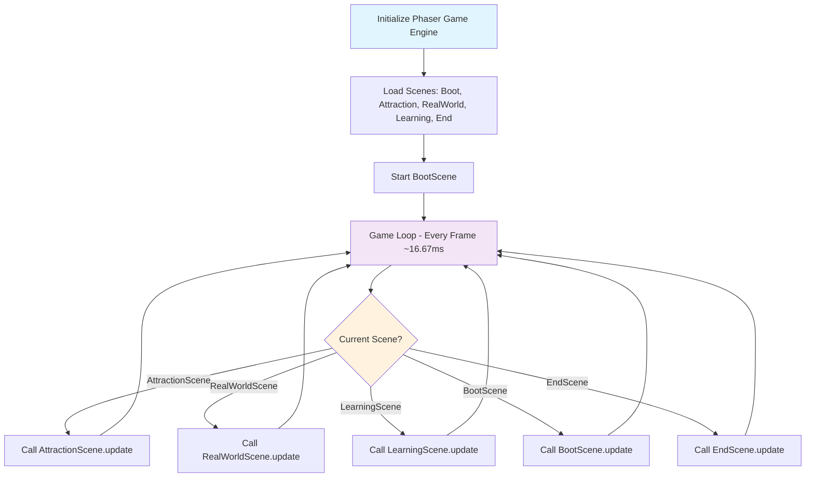
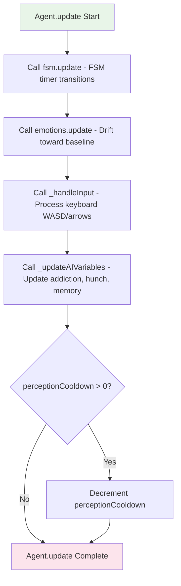
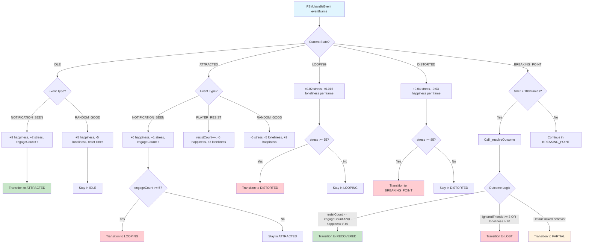
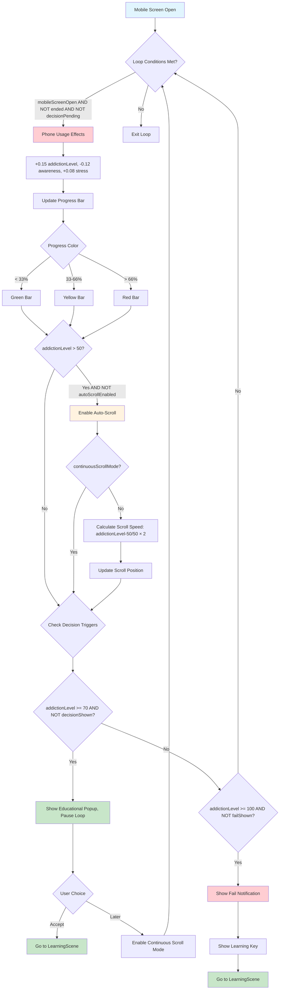
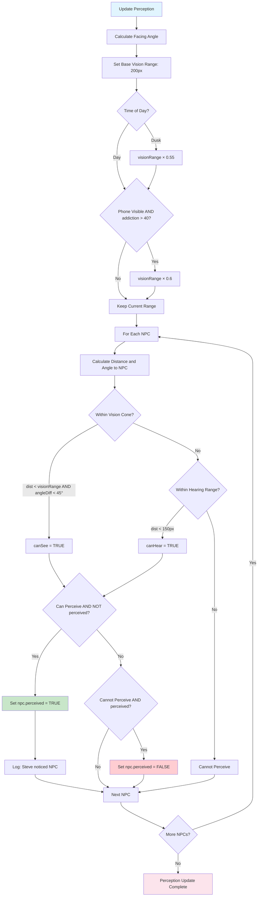
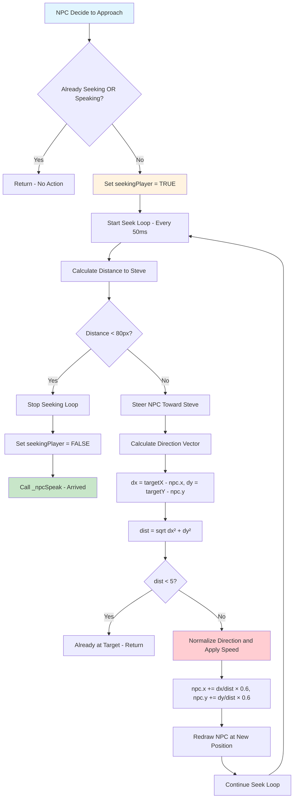
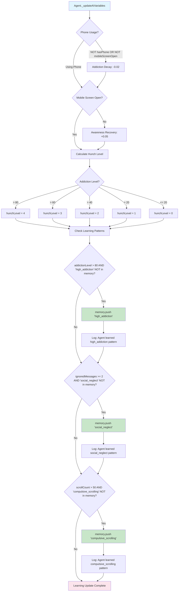
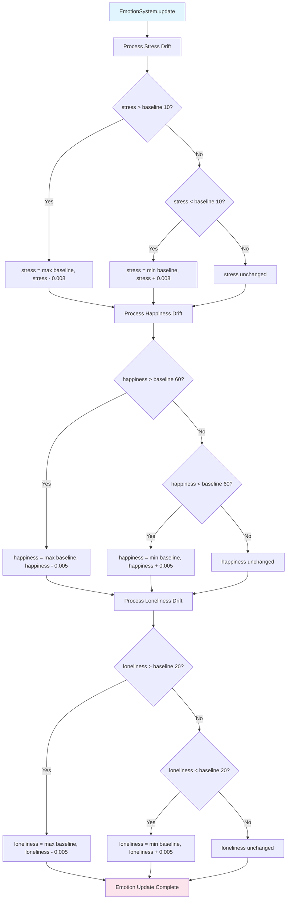
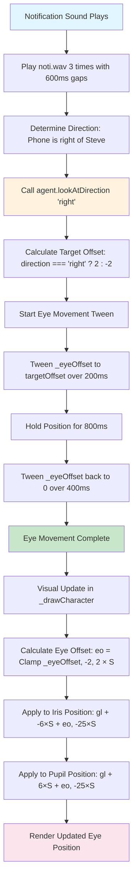

# 8. Algorithms — Flowcharts and Pseudocode

## 8.1 Main Game Loop Algorithm (Mermaid Flowchart)



## 8.2 Agent Update Algorithm (Mermaid Flowchart)



## 8.3 FSM Transition Algorithm (Mermaid Flowchart)



## 8.4 Addiction Progression Algorithm (Mermaid Flowchart)



## 8.5 Perception Algorithm (Vision Cone) (Mermaid Flowchart)



## 8.6 NPC Seek Steering Algorithm (Mermaid Flowchart)



## 8.7 Learning System Algorithm (Mermaid Flowchart)



## 8.8 Emotion Drift Algorithm (Mermaid Flowchart)



## 8.9 Eye Movement & Audio Response Algorithm (Mermaid Flowchart)



## 8.10 LearningScene Task Completion Algorithm (Mermaid Flowchart)

```mermaid
flowchart TD
    A[LearningScene Start] --> B[Display 2 Educational Tasks]
    B --> C[Focus on Task 1]
    C --> D[Wait for SPACE Key Input]
    
    D --> E{SPACE Pressed?}
    E -->|Yes| F[progress += 8]
    E -->|No| D
    
    F --> G[Update Progress Bar Visual]
    G --> H{progress >= taskProgressMax?}
    H -->|No| D
    H -->|Yes| I[Set _taskCompleting = TRUE]
    
    I --> J[Call _completeTask Task1]
    J --> K[Destroy Task 1 Card]
    K --> L[Create Task 2]
    L --> M[Focus on Task 2]
    
    M --> N[Wait for SPACE Key Input]
    N --> O{SPACE Pressed?}
    O -->|Yes| P[progress += 8]
    O -->|No| N
    
    P --> Q[Update Progress Bar Visual]
    Q --> R{progress >= taskProgressMax?}
    R -->|No| N
    R -->|Yes| S[Set _taskCompleting = TRUE]
    
    S --> T[Call _completeTask Task2]
    T --> U[Both Tasks Complete]
    U --> V[Calculate Learning Benefits]
    V --> W[Addiction: random -30 to -40]
    W --> X[Awareness: random +25 to +35]
    X --> Y[Memory: add 'educational_completion']
    Y --> Z[Show Success Card]
    Z --> AA[Return to AttractionScene with Improved Stats]
    
    style A fill:#e1f5fe
    style I fill:#fff3e0
    style S fill:#fff3e0
    style V fill:#c8e6c9
    style AA fill:#fce4ec
```



---

## Pseudocode Algorithms

### Algorithm 8.1: Main Game Loop
```
ALGORITHM: EchoSphere Main Loop
─────────────────────────────────────────────────────────────────
BEGIN
  INITIALISE Phaser game engine
  LOAD scenes: [Boot, Attraction, RealWorld, Learning, End]
  START BootScene

  LOOP (every frame ~16.67ms):
    IF current scene is AttractionScene:
      CALL AttractionScene.update()
    ELSE IF current scene is RealWorldScene:
      CALL RealWorldScene.update()
    ELSE IF current scene is LearningScene:
      CALL LearningScene.update()
    END IF
  END LOOP
END
```

### Algorithm 8.2: Agent Update
```
ALGORITHM: Agent.update()
─────────────────────────────────────────────────────────────────
BEGIN
  CALL fsm.update()           // FSM timer-based transitions
  CALL emotions.update()      // Drift emotions toward baseline
  CALL _handleInput()         // Process keyboard input
  CALL _updateAIVariables()   // Update addiction, hunch, memory
  
  IF perceptionCooldown > 0:
    DECREMENT perceptionCooldown
  END IF
END
```

### Algorithm 8.3: FSM Event Handling
```
ALGORITHM: FSM.handleEvent(eventName)
─────────────────────────────────────────────────────────────────
BEGIN
  SWITCH currentState:
    
    CASE 'IDLE':
      IF eventName = 'NOTIFICATION_SEEN':
        emotions.happiness += 8, emotions.stress += 2
        engageCount++
        TRANSITION to 'ATTRACTED'
      END IF
    
    CASE 'ATTRACTED':
      IF eventName = 'NOTIFICATION_SEEN':
        emotions.happiness += 6, emotions.stress += 1
        engageCount++
        IF engageCount >= 5:
          TRANSITION to 'LOOPING'
        END IF
      END IF
    
    CASE 'LOOPING':
      emotions.stress += 0.02 per frame
      emotions.loneliness += 0.015 per frame
      IF emotions.stress >= 65:
        TRANSITION to 'DISTORTED'
      END IF
    
    CASE 'DISTORTED':
      emotions.stress += 0.04 per frame
      emotions.happiness -= 0.03 per frame
      IF emotions.stress >= 85:
        TRANSITION to 'BREAKING_POINT'
      END IF
    
    CASE 'BREAKING_POINT':
      IF timer > 180 frames:
        CALL _resolveOutcome()
      END IF
  
  END SWITCH
END
```

### Algorithm 8.4: Addiction Progression
```
ALGORITHM: AttractionScene Phone Usage Loop
─────────────────────────────────────────────────────────────────
BEGIN
  WHILE mobileScreenOpen AND NOT ended AND NOT decisionPending:
    
    // Phone usage effects per frame
    agent.addictionLevel += 0.15
    agent.awareness      -= 0.12
    agent.emotions.stress += 0.08
    
    // Auto-scroll activation at 50% addiction
    IF addictionLevel > 50 AND NOT autoScrollEnabled:
      autoScrollEnabled = TRUE
      scrollSpeed = (addictionLevel - 50) / 50 × 2
    END IF
    
    // Educational popup at 70% addiction
    IF addictionLevel >= 70 AND NOT decisionShown:
      SHOW educational notification popup
      PAUSE loop (decisionPending = TRUE)
    END IF
    
    // Failure notification at 100% addiction
    IF addictionLevel >= 100 AND NOT failShown:
      SHOW fail notification → learning key
    END IF
  
  END WHILE
END
```

### Algorithm 8.5: Vision Cone Perception
```
ALGORITHM: RealWorldScene._updatePerception()
─────────────────────────────────────────────────────────────────
BEGIN
  facingAngle = IF agent._facingRight THEN 0 ELSE π
  halfCone = DegToRad(45)  // ±45° = 90° total cone
  
  visionRange = 200  // base range in pixels
  IF timeOfDay = 'dusk': visionRange × 0.55
  IF phoneVisible AND addictionLevel > 40: visionRange × 0.6
  
  FOR EACH npc IN npcs:
    dx = npc.x - agent.x
    dy = npc.y - agent.y
    dist = SQRT(dx² + dy²)
    angleToNPC = ATAN2(dy, dx)
    angleDiff = ABS(Wrap(angleToNPC - facingAngle))
    
    canSee  = (dist < visionRange) AND (angleDiff < halfCone)
    canHear = (dist < 150)  // omnidirectional hearing
    
    IF (canSee OR canHear) AND NOT npc.perceived:
      npc.perceived = TRUE
      LOG "Steve noticed [npc.name]"
    END IF
  END FOR
END
```

### Algorithm 8.6: NPC Seek Steering
```
ALGORITHM: RealWorldScene._steerNPCToward(npc, targetX, targetY)
─────────────────────────────────────────────────────────────────
BEGIN
  dx = targetX - npc.x
  dy = targetY - npc.y
  dist = SQRT(dx² + dy²)
  
  IF dist < 5: RETURN  // already at target
  
  speed = 0.6  // NPC_WANDER_SPEED px/frame
  
  // Normalize direction vector and scale by speed
  npc.x += (dx / dist) × speed
  npc.y += (dy / dist) × speed
  
  // Redraw NPC at new position
  npc.drawNPC(npc.emotion)
END
```

### Algorithm 8.7: Learning & Memory System
```
ALGORITHM: Agent._updateAIVariables()
─────────────────────────────────────────────────────────────────
BEGIN
  // Learning pattern detection (each stored only once)
  IF addictionLevel > 80 AND 'high_addiction' NOT IN memory:
    memory.PUSH('high_addiction')
    LOG "Agent learned: high_addiction pattern"
  END IF
  
  IF ignoredMessages >= 2 AND 'social_neglect' NOT IN memory:
    memory.PUSH('social_neglect')
    LOG "Agent learned: social_neglect pattern"
  END IF
  
  IF scrollCount > 50 AND 'compulsive_scrolling' NOT IN memory:
    memory.PUSH('compulsive_scrolling')
    LOG "Agent learned: compulsive_scrolling pattern"
  END IF
END
```

### Algorithm 8.8: Emotion Homeostasis
```
ALGORITHM: EmotionSystem.update()
─────────────────────────────────────────────────────────────────
BEGIN
  // Drift each emotion toward baseline at fixed rate
  stress     = DRIFT(stress,     baseline=10,  rate=0.008)
  happiness  = DRIFT(happiness,  baseline=60,  rate=0.005)
  loneliness = DRIFT(loneliness, baseline=20,  rate=0.005)
END

FUNCTION DRIFT(current, baseline, rate):
  IF current > baseline:
    RETURN MAX(baseline, current - rate)
  ELSE IF current < baseline:
    RETURN MIN(baseline, current + rate)
  ELSE:
    RETURN current
  END IF
END FUNCTION
```