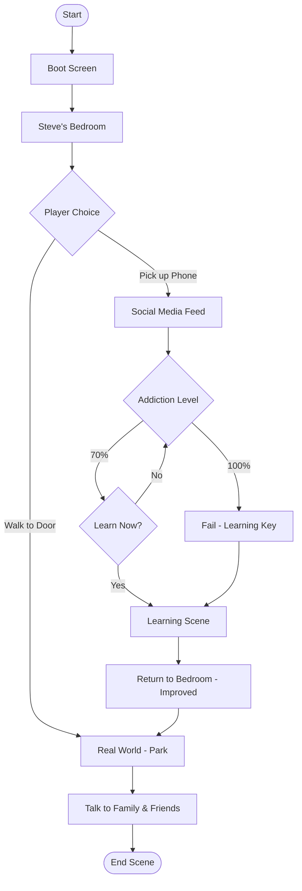
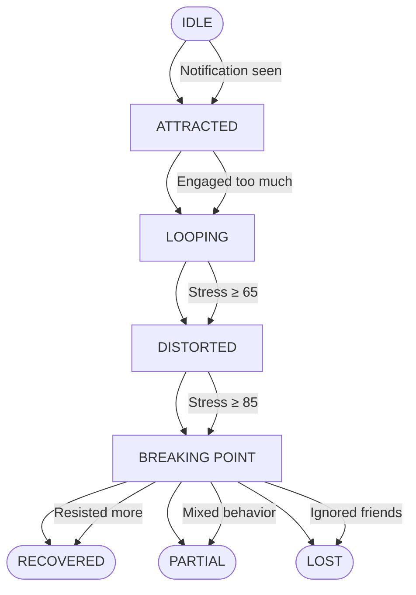
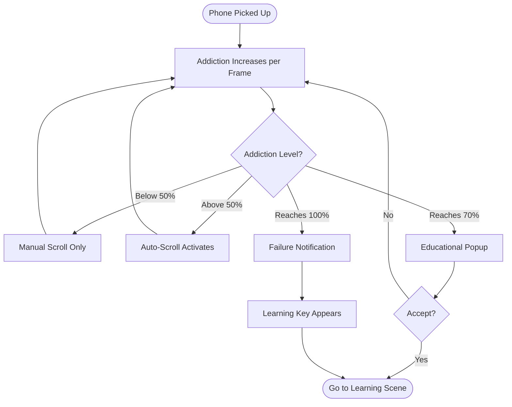
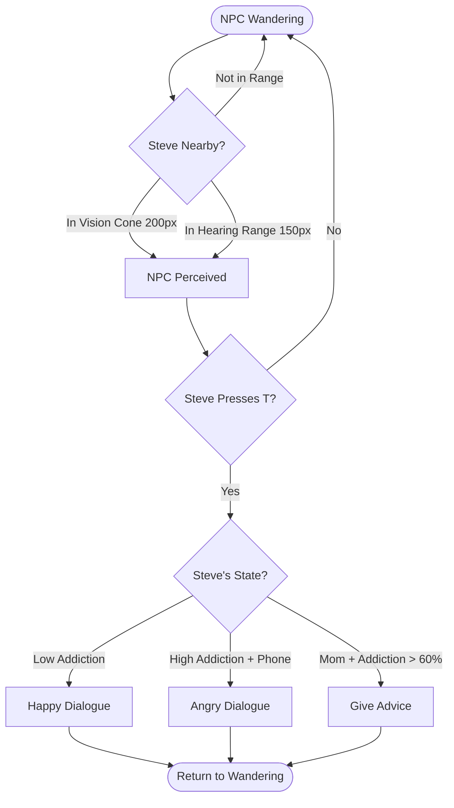
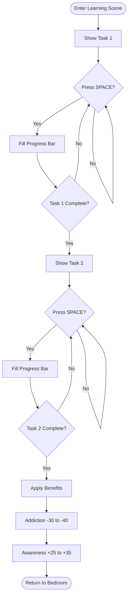
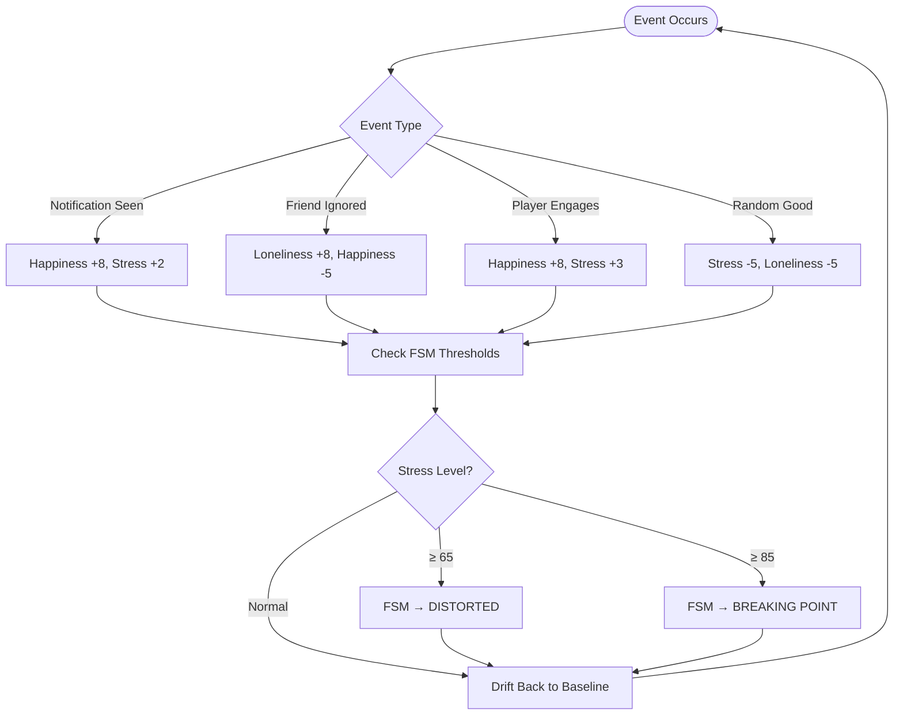
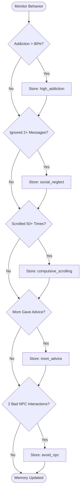
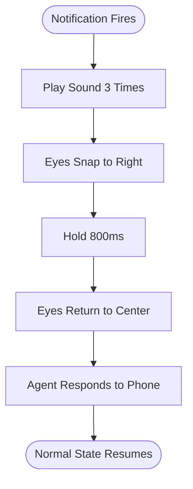

# 8. Algorithms — Flowcharts

## 8.1 Overall Game Flow

---

## 8.2 Agent FSM States

---

## 8.3 Phone Addiction Progression

---

## 8.4 NPC Perception & Interaction

---

## 8.5 Learning System

---

## 8.6 Emotion System

---

## 8.7 Memory & Learning Patterns

---

## 8.8 Eye Movement Response

