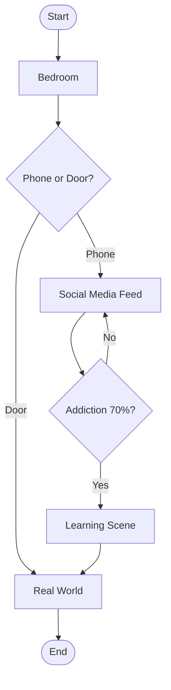
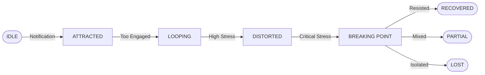
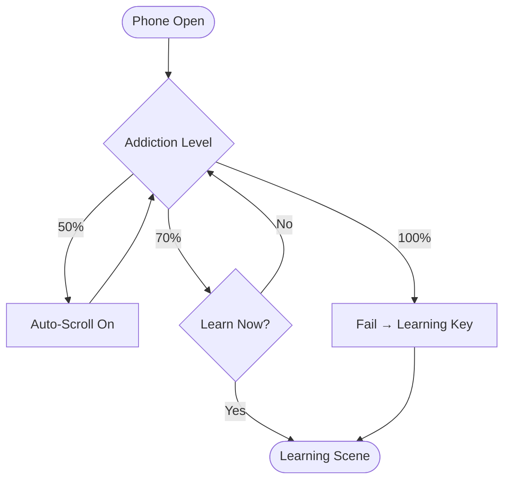
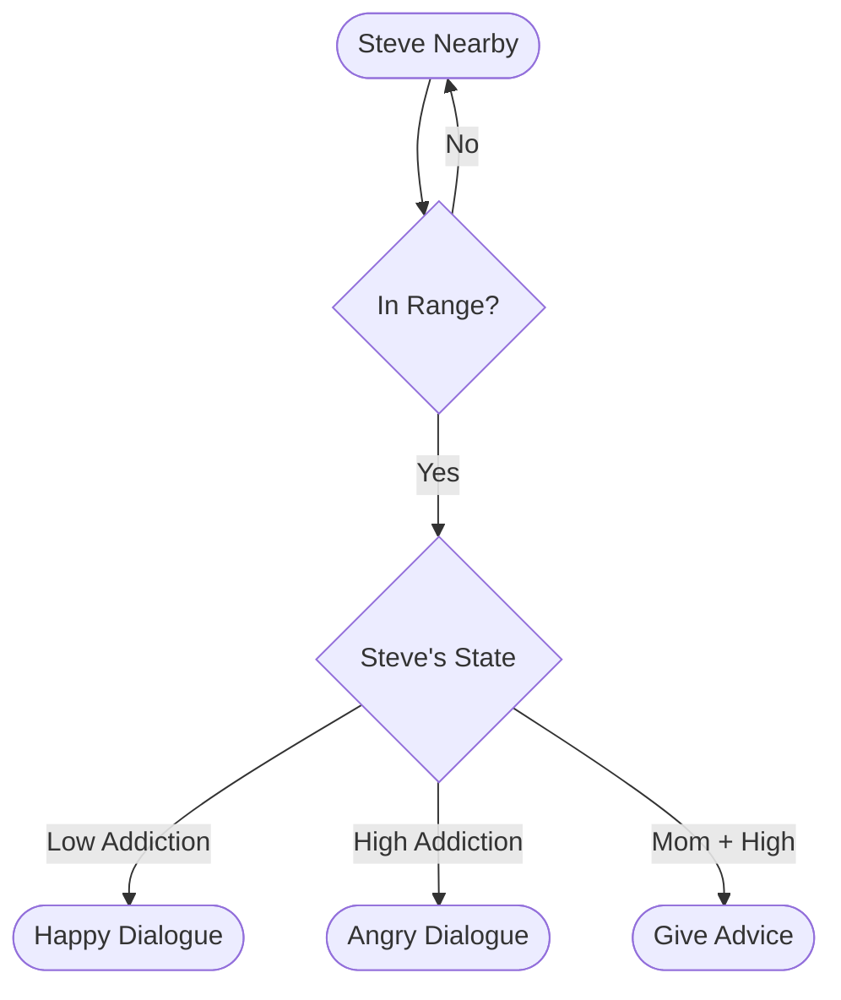
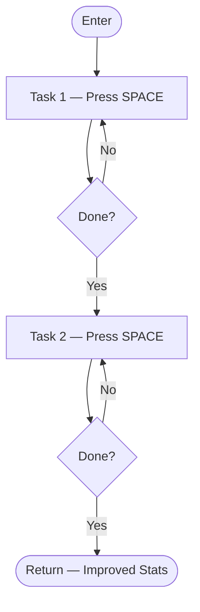

# 8. Algorithms — Flowcharts

## 8.1 Overall Game Flow

```mermaid
flowchart TD
    A([Start]) --> B[Bedroom]
    B --> C{Phone or Door?}
    C -->|Phone| D[Social Media Feed]
    C -->|Door| E[Real World]
    D --> F{Addiction 70%?}
    F -->|Yes| G[Learning Scene]
    F -->|No| D
    G --> E
    E --> H([End])
```

---

## 8.2 Agent FSM States

```mermaid
flowchart LR
    A([IDLE]) -->|Notification| B[ATTRACTED]
    B -->|Too Engaged| C[LOOPING]
    C -->|High Stress| D[DISTORTED]
    D -->|Critical Stress| E[BREAKING POINT]
    E -->|Resisted| F([RECOVERED])
    E -->|Mixed| G([PARTIAL])
    E -->|Isolated| H([LOST])
```

---

## 8.3 Addiction & Learning Flow

```mermaid
flowchart TD
    A([Phone Open]) --> B{Addiction Level}
    B -->|50%| C[Auto-Scroll On]
    B -->|70%| D{Learn Now?}
    B -->|100%| E[Fail → Learning Key]
    D -->|Yes| F([Learning Scene])
    D -->|No| B
    E --> F
    C --> B
```

---

## 8.4 NPC Interaction Flow

```mermaid
flowchart TD
    A([Steve Nearby]) --> B{In Range?}
    B -->|Yes| C{Steve's State}
    B -->|No| A
    C -->|Low Addiction| D([Happy Dialogue])
    C -->|High Addiction| E([Angry Dialogue])
    C -->|Mom + High| F([Give Advice])
```

---

## 8.5 Learning Scene Flow

```mermaid
flowchart TD
    A([Enter]) --> B[Task 1 — Press SPACE]
    B --> C{Done?}
    C -->|No| B
    C -->|Yes| D[Task 2 — Press SPACE]
    D --> E{Done?}
    E -->|No| D
    E -->|Yes| F([Return — Improved Stats])
```
